# 架构设计详解

## 概述

mingsha-javaagent-methodtime 采用模块化、高可用的架构设计，通过字节码增强技术实现零侵入的方法耗时监控，支持高并发采集、数据持久化和远程管理。

## 整体架构

> 下图为 mingsha-javaagent-methodtime 的总体架构设计：



---

### 1. 架构层次

```
┌─────────────────────────────────────────────────────────────┐
│                    应用层 (Application Layer)                │
├─────────────────────────────────────────────────────────────┤
│  Java Agent 入口 (MethodTimeAgent)                          │
│  ├── premain() - 启动时加载                                  │
│  └── agentmain() - 运行时动态加载                           │
├─────────────────────────────────────────────────────────────┤
│                    增强层 (Enhancement Layer)               │
├─────────────────────────────────────────────────────────────┤
│  字节码增强 (MethodTimeTransformer)                         │
│  ├── ASM 字节码操作                                         │
│  ├── 方法入口/出口插桩                                       │
│  └── 采样率控制                                             │
├─────────────────────────────────────────────────────────────┤
│                    采集层 (Collection Layer)                │
├─────────────────────────────────────────────────────────────┤
│  数据采集 (MethodTimeBuffer)                                │
│  ├── 内存缓冲队列                                           │
│  ├── 批量消费                                               │
│  └── 并发安全                                               │
├─────────────────────────────────────────────────────────────┤
│                    存储层 (Storage Layer)                   │
├─────────────────────────────────────────────────────────────┤
│  数据存储 (H2Storage)                                       │
│  ├── H2 数据库                                              │
│  ├── 批量写入                                               │
│  ├── 失败转存                                               │
│  └── 自动补偿                                               │
├─────────────────────────────────────────────────────────────┤
│                    管理层 (Management Layer)                │
├─────────────────────────────────────────────────────────────┤
│  远程管理 (TelnetServer)                                    │
│  ├── Telnet 协议                                            │
│  ├── SQL 查询                                               │
│  ├── 状态监控                                               │
│  └── 配置热加载                                             │
├─────────────────────────────────────────────────────────────┤
│                    监控层 (Monitoring Layer)                │
├─────────────────────────────────────────────────────────────┤
│  系统监控 (AgentMonitor)                                    │
│  ├── CPU 监控                                               │
│  ├── 内存监控                                               │
│  ├── 数据丢失统计                                           │
│  └── CPU 熔断                                               │
├─────────────────────────────────────────────────────────────┤
│                    守护层 (Guardian Layer)                  │
├─────────────────────────────────────────────────────────────┤
│  线程守护 (ThreadGuardian)                                  │
│  ├── 线程健康检查                                           │
│  ├── 自动重启                                               │
│  ├── 异常处理                                               │
│  └── 资源管理                                               │
└─────────────────────────────────────────────────────────────┘
```

### 2. 核心模块

#### 2.1 增强模块 (Enhancer)
- **MethodTimeAgent**: Java Agent 入口，负责初始化和协调各模块
- **MethodTimeTransformer**: 字节码增强器，使用 ASM 实现方法插桩

#### 2.2 采集模块 (Collector)
- **MethodTimeRecord**: 方法耗时数据模型
- **MethodTimeBuffer**: 内存缓冲队列，支持高并发采集

#### 2.3 存储模块 (Storage)
- **H2Storage**: H2 数据库存储引擎，支持批量写入和失败转存

#### 2.4 管理模块 (Management)
- **TelnetServer**: Telnet 服务器，提供远程管理接口
- **TelnetSession**: Telnet 会话处理，支持 SQL 查询和命令执行

#### 2.5 监控模块 (Monitoring)
- **AgentMonitor**: 系统监控器，监控 CPU、内存和业务指标

#### 2.6 工具模块 (Util)
- **AgentConfig**: 配置管理器，支持 YAML 配置和热加载
- **AgentExceptionHandler**: 全局异常处理器
- **ShutdownManager**: 无损卸载管理器
- **ThreadGuardian**: 线程健康守护器

## 数据流设计

### 1. 方法耗时采集流程

```
方法调用 → 字节码增强 → 开始时间记录 → 原始方法执行 → 结束时间记录 → 数据采集
    ↓
内存缓冲队列 → 批量消费 → H2 数据库存储
    ↓
失败转存 → 本地 CSV 文件 → 自动补偿 → 重新入库
```

### 2. 数据流转详细说明

#### 2.1 采集阶段
1. **字节码增强**: 在方法入口插入 `System.nanoTime()` 调用
2. **数据封装**: 在方法出口创建 `MethodTimeRecord` 对象
3. **缓冲入队**: 将记录放入 `ArrayBlockingQueue` 缓冲队列

#### 2.2 存储阶段
1. **批量消费**: 存储线程定期从队列批量获取数据
2. **数据库写入**: 使用 `PreparedStatement.addBatch()` 批量写入 H2
3. **失败处理**: 写入失败时转存到本地 CSV 文件

#### 2.3 补偿阶段
1. **文件扫描**: 定期扫描本地备份文件
2. **数据解析**: 解析 CSV 文件内容
3. **重新入库**: 将备份数据重新写入数据库

## 并发设计

### 1. 线程模型

```
┌─────────────────┐    ┌─────────────────┐    ┌─────────────────┐
│   采集线程池     │    │   存储线程       │    │   管理线程       │
│  (业务线程)      │    │  (单线程)        │    │  (多线程)        │
├─────────────────┤    ├─────────────────┤    ├─────────────────┤
│ - 方法执行       │    │ - 批量消费       │    │ - Telnet 服务   │
│ - 数据采集       │    │ - 数据库写入     │    │ - 健康检查       │
│ - 缓冲入队       │    │ - 失败转存       │    │ - 监控统计       │
└─────────────────┘    └─────────────────┘    └─────────────────┘
         │                       │                       │
         └───────────────────────┼───────────────────────┘
                                 │
                    ┌─────────────────┐
                    │   缓冲队列       │
                    │ (ArrayBlockingQueue) │
                    └─────────────────┘
```

### 2. 并发安全策略

#### 2.1 生产者-消费者模式
- **生产者**: 业务线程（方法执行时采集数据）
- **消费者**: 存储线程（批量消费并写入数据库）
- **缓冲区**: `ArrayBlockingQueue` 线程安全队列

#### 2.2 线程安全保证
- **无锁设计**: 使用 `ArrayBlockingQueue` 避免显式锁
- **原子操作**: 使用 `System.nanoTime()` 保证时间戳原子性
- **内存可见性**: 使用 `volatile` 关键字保证变量可见性

#### 2.3 死锁预防
- **资源顺序**: 统一资源获取顺序
- **超时机制**: 设置操作超时时间
- **异常处理**: 完善的异常处理机制

## 高可用设计

### 1. 故障隔离

#### 1.1 异常隔离
```java
// 全局异常处理器
public class AgentExceptionHandler implements Thread.UncaughtExceptionHandler {
    @Override
    public void uncaughtException(Thread t, Throwable e) {
        // 记录异常但不影响主进程
        System.err.println("[mingsha-agent] 捕获异常于线程: " + t.getName());
        e.printStackTrace(System.err);
    }
}
```

#### 1.2 模块隔离
- **字节码增强**: 增强失败时返回原始字节码
- **数据采集**: 采集异常不影响业务逻辑
- **数据存储**: 存储失败时转存本地文件

### 2. 自愈机制

#### 2.1 线程自愈
```java
public class ThreadGuardian implements Runnable {
    @Override
    public void run() {
        while (running) {
            for (Map.Entry<String, Thread> entry : threads.entrySet()) {
                Thread thread = entry.getValue();
                if (!thread.isAlive()) {
                    // 自动重启死掉的线程
                    Thread newThread = threadFactories.get(entry.getKey()).newThread();
                    threads.put(entry.getKey(), newThread);
                    newThread.start();
                }
            }
            Thread.sleep(checkIntervalMs);
        }
    }
}
```

#### 2.2 数据自愈
- **失败转存**: 数据库写入失败时自动转存本地文件
- **自动补偿**: 定期扫描并补偿本地备份数据
- **数据校验**: 定期校验数据完整性

### 3. 熔断机制

#### 3.1 CPU 熔断
```java
public class AgentMonitor implements Runnable {
    @Override
    public void run() {
        while (running) {
            double cpuLoad = getProcessCpuLoad();
            int fuseThreshold = AgentConfig.getCpuFuseThreshold();

            if (cpuLoad >= fuseThreshold / 100.0) {
                fuseActive = true;
                System.err.printf("[mingsha-agent][熔断] CPU占用 %.2f%% 超阈值 %d%%，暂停采集...\n",
                    cpuLoad * 100, fuseThreshold);
            } else if (fuseActive && cpuLoad < (fuseThreshold - 10) / 100.0) {
                fuseActive = false;
                System.out.println("[mingsha-agent][熔断] CPU恢复，采集线程恢复工作");
            }
        }
    }
}
```

## 性能优化设计

### 1. 内存优化

#### 1.1 对象池化
- **MethodTimeRecord 复用**: 避免频繁创建对象
- **String 常量池**: 利用 JVM 字符串常量池
- **局部变量复用**: 合理分配局部变量槽位

#### 1.2 内存布局优化
- **紧凑对象**: 使用 `@Contended` 注解避免伪共享
- **内存对齐**: 合理设计对象字段顺序
- **GC 友好**: 及时释放不再使用的对象

### 2. I/O 优化

#### 2.1 批量操作
```java
// 批量写入数据库
public static void batchInsert(List<MethodTimeRecord> records) {
    try (PreparedStatement ps = conn.prepareStatement(sql)) {
        for (MethodTimeRecord r : records) {
            ps.setString(1, r.className);
            // ... 设置其他参数
            ps.addBatch();
        }
        ps.executeBatch(); // 一次性执行所有批量操作
    }
}
```

#### 2.2 异步 I/O
- **非阻塞队列**: 使用 `ArrayBlockingQueue` 避免阻塞
- **异步写入**: 存储操作在独立线程中执行
- **缓冲写入**: 使用文件缓冲减少磁盘 I/O

### 3. CPU 优化

#### 3.1 采样率控制
```java
// 采样率控制
if (Math.random() >= AgentConfig.getSamplingRate()) {
    return; // 跳过采集
}
```

#### 3.2 热点优化
- **内联优化**: 关键方法使用 `@HotSpotIntrinsicCandidate`
- **循环优化**: 避免在热点路径中使用复杂循环
- **分支预测**: 优化条件分支的预测准确性

## 扩展性设计

### 1. 插件化架构

#### 1.1 存储插件
```java
public interface StoragePlugin {
    void init();
    void batchInsert(List<MethodTimeRecord> records);
    void close();
}

// 实现类
public class H2StoragePlugin implements StoragePlugin {
    // H2 实现
}

public class MySQLStoragePlugin implements StoragePlugin {
    // MySQL 实现
}
```

#### 1.2 采集插件
```java
public interface CollectorPlugin {
    boolean shouldCollect(String className, String methodName);
    MethodTimeRecord collect(String className, String methodName, long startTime, long endTime);
}
```

### 2. 配置化设计

#### 2.1 动态配置
```yaml
# agent-config.yml
collector:
  packages: "com.example.*"
  samplingRate: 1.0
  minDurationNs: 100000

storage:
  type: "h2"  # 可配置存储类型
  h2:
    path: "./mingsha_javaagent_method_time_h2_db"
  mysql:
    url: "jdbc:mysql://localhost:3306/methodtime"
    username: "root"
    password: "password"
```

#### 2.2 热加载支持
```java
public static synchronized void reload() {
    Yaml yaml = new Yaml();
    try (InputStream in = AgentConfig.class.getResourceAsStream(CONFIG_FILE)) {
        Map<String, Object> newConfig = yaml.load(in);
        if (newConfig != null) {
            config.clear();
            config.putAll(newConfig);
        }
    }
}
```

## 监控与运维

### 1. 监控指标

#### 1.1 业务指标
- **采集量**: 每秒采集的方法数量
- **存储量**: 每秒存储的记录数量
- **丢失率**: 数据丢失的比例
- **响应时间**: 方法平均执行时间

#### 1.2 系统指标
- **CPU 使用率**: 进程 CPU 占用
- **内存使用率**: 进程内存占用
- **线程状态**: 各线程的运行状态
- **队列状态**: 缓冲队列的使用情况

### 2. 运维支持

#### 2.1 远程管理
```bash
# Telnet 连接
telnet localhost 5005

# 查看状态
agent status

# 执行 SQL 查询
SELECT COUNT(*) FROM method_time_stat;

# 导出数据
agent export data.csv

# 热加载配置
agent reload
```

#### 2.2 日志管理
- **分级日志**: INFO、DEBUG、ERROR 不同级别
- **结构化日志**: JSON 格式便于解析
- **日志轮转**: 自动轮转避免文件过大

## 部署架构

### 1. 单机部署
```
┌─────────────────────────────────────────────────────────────┐
│                    目标应用                                  │
│  ┌─────────────────┐  ┌─────────────────┐  ┌─────────────────┐ │
│  │   Java Agent    │  │   H2 数据库     │  │   Telnet 服务   │ │
│  │   (JVM 内)      │  │   (本地文件)     │  │   (端口 5005)   │ │
│  └─────────────────┘  └─────────────────┘  └─────────────────┘ │
└─────────────────────────────────────────────────────────────┘
```

### 2. 分布式部署
```
┌─────────────────┐    ┌─────────────────┐    ┌─────────────────┐
│   应用实例 1     │    │   应用实例 2     │    │   应用实例 N     │
│  ┌─────────────┐ │    │  ┌─────────────┐ │    │  ┌─────────────┐ │
│  │ Java Agent  │ │    │  │ Java Agent  │ │    │  │ Java Agent  │ │
│  └─────────────┘ │    │  └─────────────┘ │    │  └─────────────┘ │
└─────────────────┘    └─────────────────┘    └─────────────────┘
         │                       │                       │
         └───────────────────────┼───────────────────────┘
                                 │
                    ┌─────────────────┐
                    │   数据聚合服务   │
                    │  (可选)         │
                    └─────────────────┘
```

## 扩展阅读

- [Java Agent 技术规范](https://docs.oracle.com/javase/8/docs/api/java/lang/instrument/package-summary.html)
- [ASM 字节码增强](https://asm.ow2.io/)
- [H2 数据库架构](http://www.h2database.com/html/architecture.html)
- [高可用系统设计](https://en.wikipedia.org/wiki/High_availability)
